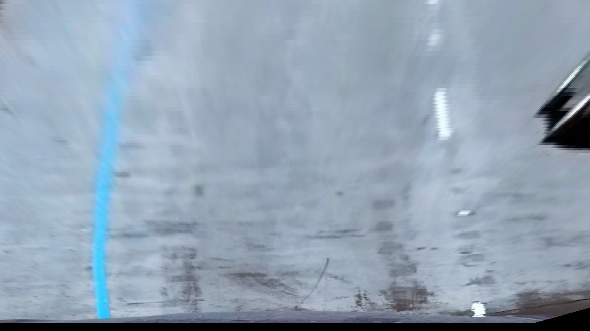
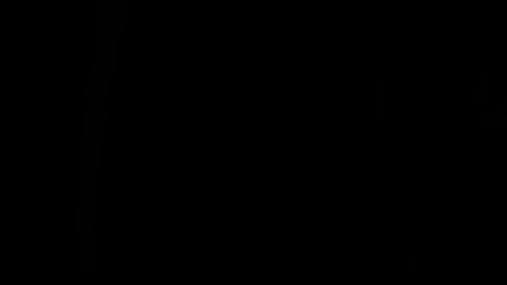
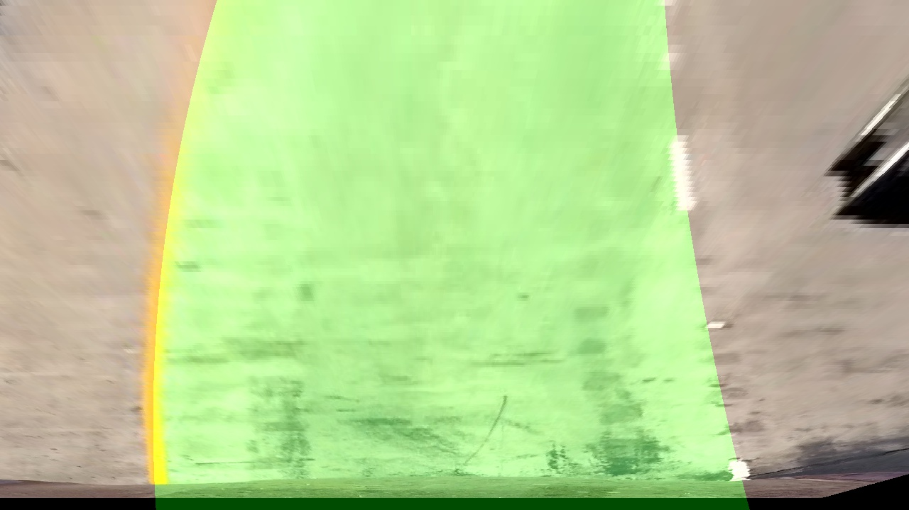
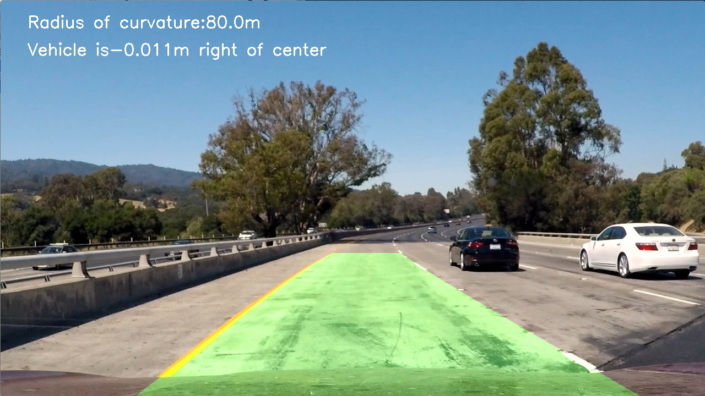

## Writeup Template

### You can use this file as a template for your writeup if you want to submit it as a markdown file, but feel free to use some other method and submit a pdf if you prefer.

---

**Advanced Lane Finding Project**

The goals / steps of this project are the following:

* Compute the camera calibration matrix and distortion coefficients given a set of chessboard images.
* Apply a distortion correction to raw images.
* Use color transforms, gradients, etc., to create a thresholded binary image.
* Apply a perspective transform to rectify binary image ("birds-eye view").
* Detect lane pixels and fit to find the lane boundary.
* Determine the curvature of the lane and vehicle position with respect to center.
* Warp the detected lane boundaries back onto the original image.
* Output visual display of the lane boundaries and numerical estimation of lane curvature and vehicle position.

[//]: # (Image References)

[image1]: ./examples/undistort_output.png "Undistorted"
[image2]: ./test_images/test1.jpg "Road Transformed"
[image3]: ./examples/binary_combo_example.jpg "Binary Example"
[image4]: ./examples/warped_straight_lines.jpg "Warp Example"
[image5]: ./examples/color_fit_lines.jpg "Fit Visual"
[image6]: ./examples/example_output.jpg "Output"
[video1]: ./project_video.mp4 "Video"

## [Rubric](https://review.udacity.com/#!/rubrics/571/view) Points

### Here I will consider the rubric points individually and describe how I addressed each point in my implementation.  

---

### Writeup / README

#### 1. Provide a Writeup / README that includes all the rubric points and how you addressed each one.  You can submit your writeup as markdown or pdf.  [Here](https://github.com/udacity/CarND-Advanced-Lane-Lines/blob/master/writeup_template.md) is a template writeup for this project you can use as a guide and a starting point.  

You're reading it!

### Camera Calibration

#### 1. Briefly state how you computed the camera matrix and distortion coefficients. Provide an example of a distortion corrected calibration image.

The code for this step is contained in the first code cell of the IPython notebook located in "./examples/example.ipynb" (or in lines # through # of the file called `some_file.py`).  

I start by preparing "object points", which will be the (x, y, z) coordinates of the chessboard corners in the world. Here I am assuming the chessboard is fixed on the (x, y) plane at z=0, such that the object points are the same for each calibration image.  Thus, `objp` is just a replicated array of coordinates, and `objpoints` will be appended with a copy of it every time I successfully detect all chessboard corners in a test image.  `imgpoints` will be appended with the (x, y) pixel position of each of the corners in the image plane with each successful chessboard detection.  

I then used the output `objpoints` and `imgpoints` to compute the camera calibration and distortion coefficients using the `cv2.calibrateCamera()` function.  I applied this distortion correction to the test image using the `cv2.undistort()` function and obtained this result: 

The origin image is './camera_cal/calibration1.jpg'.
The result shows in './output_images/calibration_example.jpg'.


### Pipeline (single images)

#### 1. Provide an example of a distortion-corrected image.

To demonstrate this step, I will describe how I apply the distortion correction to one of the test images like this one:

I used the function "undistort(img, mtx, dist)" to undistort the images.
The origin image is './test_images/test1.jpg'.
The result shows in './output_images/calibration1.jpg'.


#### 2. Describe how (and identify where in your code) you used color transforms, gradients or other methods to create a thresholded binary image.  Provide an example of a binary image result.

I used a combination of sobel transformation and gradient thresholds to generate a binary image. I transform RGB images to HLS images, and I chose S channel to do edge and color detection. The code shows in function "edge_detection()".
The code shows in the 6th cell in the file 'myExample.ipynb'. 

Here's an example of my output for this step.
The origin image is './output_images/perspective_example.jpg'.
The result shows in './output_images/binary_example.jpg'.




#### 3. Describe how (and identify where in your code) you performed a perspective transform and provide an example of a transformed image.

The code for my perspective transform includes a function called `perspective_transform()`, which appears in the 4th cell in the file `myExample.ipynb`.  The `perspective_transform()` function takes as inputs an image (`img`), and use the source (`src`) and destination (`dst`) points.  I chose the hardcode the source and destination points in the following manner:

```python
left_up = (580, 460)
right_up = (740, 460)
left_down = (280, 680)
right_down = (1050, 680)
src = np.float32([left_up, left_down, right_up, right_down])
dst = np.float32([[200, 0], [200, 680], [1000, 0], [1000, 680]])
```

This resulted in the following source and destination points:

| Source        | Destination   | 
|:-------------:|:-------------:| 
| 580, 460      | 200, 0        | 
| 740, 460      | 200, 680      |
| 280, 680      | 1000, 0       |
| 1050, 680     | 1000, 680     |

I verified that my perspective transform was working as expected by drawing the `src` and `dst` points onto a test image and its warped counterpart to verify that the lines appear parallel in the warped image.

The origin image is './test_images/test1.jpg'.
The result shows in './output_images/perspective_example.jpg'.


#### 4. Describe how (and identify where in your code) you identified lane-line pixels and fit their positions with a polynomial?

I used a technique called "sliding window" to search for points on the left and right lanes in the graph. Firstly, according to the histogram method, the approximate positions of the left and right lanes are found, and the two approximate positions are taken as the starting points. Then the stored abscissa is averaged, and the column where the mean is located and the position of the upper edge of the first window are taken as the middle point of the lower edge of the next window. Then the curve equation of the lane line can be obtained by fitting these points with cubic curve.

The code shows in the 7th and 8th cells in the file 'myExample.ipynb'. 

#### 5. Describe how (and identify where in your code) you calculated the radius of curvature of the lane and the position of the vehicle with respect to center.

I used the curvature radius formula to get the fitted cubic curve, and then the curve equation and y are used to get the fitted cubic curve.
```python
left_fitx = left_fit[0] * ploty ** 2 + left_fit[1] * ploty + left_fit[2]
right_fitx = right_fit[0] * ploty ** 2 + right_fit[1] * ploty + right_fit[2]
```
The code shows in the function "find_lines" in the 8th cell.

#### 6. Provide an example image of your result plotted back down onto the road such that the lane area is identified clearly.

I implemented this step in `myExample.ipynb` in the function `show_lanes()`.  Here is an example of my result on a test image:

The results show in './output_images/draw_lanes_example1.jpg' and './output_images/draw_lanes_example2.jpg'. 




### Pipeline (video)

#### 1. Provide a link to your final video output.  Your pipeline should perform reasonably well on the entire project video (wobbly lines are ok but no catastrophic failures that would cause the car to drive off the road!).

The result shows in './output_video.mp4'

### Discussion

#### 1. Briefly discuss any problems / issues you faced in your implementation of this project.  Where will your pipeline likely fail?  What could you do to make it more robust?

Here I'll talk about the approach I took, what techniques I used, what worked and why, where the pipeline might fail and how I might improve it if I were going to pursue this project further. 

The biggest problem I encountered in this project was that I didn't know how to deal with the problem of curved lanes. After consulting the information on the Internet, I learned how to use "sliding window" to fit curve and how to realize it. 
When the images only show one lane(only have left lane or right lane) or the lanes is covered by shadows, this pipline might fail.Just like the videos('./output_challenge_video.mp4' and './output_harder_challenge_video'), the results are not good. 
I'm not sure whether it's the computer configuration or the algorithm that the process of lane detection is really slow. So I hope to learn deep learning to make this process faster and applied to any video.

